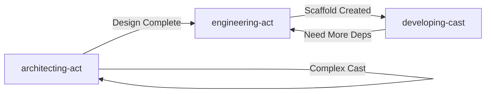

# Skill Verification Report

## Phase 1: Internal Consistency Check

### architecting-act

**Referenced Resources in SKILL.md:**
- ✅ `modes/initial-design-questions.md` - EXISTS
- ✅ `modes/add-cast-questions.md` - EXISTS
- ✅ `modes/extract-subcast-questions.md` - EXISTS
- ✅ `cast-analysis-guide.md` - EXISTS
- ✅ `pattern-decision-matrix.md` - EXISTS
- ✅ `resources/design/state-schema.md` - EXISTS
- ✅ `resources/design/node-specification.md` - EXISTS
- ✅ `resources/design/edge-routing.md` - EXISTS
- ✅ `resources/output-template.md` - EXISTS
- ✅ `resources/validation-checklist.md` - EXISTS
- ✅ `scripts/validate_architecture.py` - EXISTS

**Deleted Files (from git status):**
- ❌ `patterns/branching.md` - DELETED (not referenced in current SKILL.md ✓)
- ❌ `patterns/cyclic.md` - DELETED (not referenced in current SKILL.md ✓)
- ❌ `patterns/multi-agent.md` - DELETED (not referenced in current SKILL.md ✓)
- ❌ `patterns/sequential.md` - DELETED (not referenced in current SKILL.md ✓)
- ❌ `question-templates.md` - DELETED (not referenced in current SKILL.md ✓)

**Status:** ✅ No broken links. Deleted files are not referenced.

---

### developing-cast

**Referenced Resources in Component Reference Tables:**

**Core Components:**
- ✅ `usage/core/state.md` - EXISTS
- ✅ `usage/core/node.md` - EXISTS
- ✅ `usage/core/edge.md` - EXISTS
- ✅ `usage/core/graph.md` - EXISTS
- ✅ `usage/core/subgraph.md` - EXISTS

**Prompts & Messages:**
- ✅ `usage/prompts/message-types.md` - EXISTS
- ✅ `usage/prompts/multimodal.md` - EXISTS
- ❓ `usage/prompts/messages.md` - Check if referenced (found in .venv)
- ❓ `usage/prompts/multi-modal.md` - Check vs multimodal.md (duplicate?)

**Models & Agents:**
- ✅ `usage/models/select-chat-models.md` - EXISTS
- ✅ `usage/models/standalone-model.md` - EXISTS
- ✅ `usage/models/structured-output.md` - EXISTS
- ✅ `usage/agents/configuration.md` - EXISTS
- ✅ `usage/agents/structured-output.md` - EXISTS

**Tools:**
- ✅ `usage/tools/basic-tool.md` - EXISTS
- ✅ `usage/tools/tool-with-complex-inputs.md` - EXISTS
- ✅ `usage/tools/access-context.md` - EXISTS

**Memory:**
- ✅ `usage/memory/short-term/add-to-agent.md` - EXISTS
- ✅ `usage/memory/short-term/customize-agent-memory.md` - EXISTS
- ✅ `usage/memory/short-term/manage-conversations.md` - EXISTS
- ✅ `usage/memory/short-term/access-and-modify-memory.md` - EXISTS
- ✅ `usage/memory/long-term/memory-storage.md` - EXISTS
- ✅ `usage/memory/long-term/in-tools.md` - EXISTS

**Middleware - Reliability:**
- ✅ `usage/middlewares/provider-agnostic/model-retry.md` - EXISTS
- ✅ `usage/middlewares/provider-agnostic/tool-retry.md` - EXISTS
- ✅ `usage/middlewares/provider-agnostic/model-fallback.md` - EXISTS

**Middleware - Safety & Control:**
- ✅ `usage/middlewares/provider-agnostic/guardrails.md` - EXISTS
- ✅ `usage/middlewares/provider-agnostic/model-call-limit.md` - EXISTS
- ✅ `usage/middlewares/provider-agnostic/tool-call-limit.md` - EXISTS
- ✅ `usage/middlewares/provider-agnostic/human-in-the-loop.md` - EXISTS

**Middleware - Tool Management:**
- ✅ `usage/middlewares/provider-agnostic/llm-tool-selector.md` - EXISTS
- ✅ `usage/middlewares/provider-agnostic/llm-tool-emulator.md` - EXISTS
- ✅ `usage/middlewares/provider-agnostic/shell-tool.md` - EXISTS
- ✅ `usage/middlewares/provider-agnostic/file-search.md` - EXISTS
- ✅ `usage/middlewares/provider-agnostic/to-do-list.md` - EXISTS

**Middleware - Context:**
- ✅ `usage/middlewares/provider-agnostic/context-editing.md` - EXISTS
- ✅ `usage/middlewares/provider-agnostic/summarization.md` - EXISTS

**Middleware - Provider-Specific:**
- ✅ `usage/middlewares/provider-specific/openai.md` - EXISTS
- ✅ `usage/middlewares/provider-specific/anthropic.md` - EXISTS
- ✅ `usage/middlewares/custom.md` - EXISTS

**Integrations:**
- ✅ `usage/integrations/embedding.md` - EXISTS
- ✅ `usage/integrations/vector-stores.md` - EXISTS
- ✅ `usage/integrations/text-spliter.md` - EXISTS

**Deleted Files (from git status):**
- ❌ `analysis-architecture.md` - DELETED
- ❌ `usage/prompts/messages.md` - Check if used (exists in .venv)
- ❌ `usage/prompts/multi-modal.md` - vs multimodal.md?

**Potential Issues:**
- ⚠️ Line 88: References `prompts/message-types.md` but deleted `prompts/messages.md` exists in .venv
- ⚠️ Need to verify if multimodal.md vs multi-modal.md naming inconsistency

**Status:** ⚠️ Need to check prompts/ references more carefully

---

### engineering-act

**Referenced Resources in SKILL.md:**
- ✅ `resources/create-cast.md` - EXISTS
- ✅ `resources/add-dep-act.md` - EXISTS
- ✅ `resources/add-dep-cast.md` - EXISTS
- ✅ `resources/sync.md` - EXISTS

**Status:** ✅ No broken links

---

## Phase 2: Skill Content Quality

### architecting-act

**Workflow Validation:**

1. **Mode Detection Logic:**
   - ✅ Clear decision points: CLAUDE.md exists? → Yes/No
   - ✅ Three modes well-defined
   - ✅ Each mode has dedicated question file

2. **Cast Design Workflow:**
   ```
   Pattern Selection → State Schema → Node Specification →
   Architecture Diagram → Technology Stack → Validate
   ```
   - ✅ Logical progression
   - ✅ Each step has resource file
   - ✅ Validation at end

3. **Core Principles:**
   - ✅ INTERACTIVE: "Ask ONE question at a time"
   - ✅ NO CODE: "Describe structures only"
   - ✅ DIAGRAMS SHOW EDGES: "Mermaid diagram contains all nodes and edges"

**Quality Assessment:** ✅ EXCELLENT
- Clear workflow
- Well-organized modes
- Strong principles enforcement

---

### developing-cast

**Workflow Validation:**

1. **Implementation Order:**
   ```
   state → dependency modules → nodes → conditions → graph
   ```
   - ✅ Logical dependency order
   - ✅ State first (foundation)
   - ✅ Graph last (assembly)

2. **Component Reference Organization:**
   - ✅ Categorized by concern (Core, Prompts, Models, Tools, Memory, Middleware, Integrations)
   - ✅ "Use when..." format for each entry
   - ✅ 50+ resources well-organized

3. **CLAUDE.md Integration:**
   - ✅ Step 1: Check if CLAUDE.md exists
   - ✅ Clear: "If CLAUDE.md exists" vs "If CLAUDE.md not found"
   - ✅ Flexibility: Can implement without specs

**Quality Assessment:** ✅ EXCELLENT
- Comprehensive reference
- Clear workflow
- Flexible (with/without CLAUDE.md)

---

### engineering-act

**Workflow Validation:**

1. **Pre-operation Check:**
   ```
   Before any operation:
   1. Check CLAUDE.md if it exists
   2. Proceed with operation
   ```
   - ✅ Consistent pattern
   - ✅ Context-aware

2. **Operations Coverage:**
   - ✅ Create cast (scaffolding)
   - ✅ Add dependencies (monorepo + cast-level)
   - ✅ Sync environment
   - ✅ LangGraph server

3. **Quick Reference:**
   - ✅ Practical commands
   - ✅ Common workflows
   - ✅ Dependency groups explained

**Quality Assessment:** ✅ EXCELLENT
- Practical and concise
- Clear operations
- Good quick reference

---

## Phase 3: Skill Boundary Clarity

### Cross-Reference Analysis

**architecting-act ↔ developing-cast ↔ engineering-act**



**Boundary Table:**

| Scenario | architecting-act | engineering-act | developing-cast |
|----------|-----------------|-----------------|-----------------|
| "Design new cast" | ✅ YES | ❌ NO | ❌ NO |
| "Create cast package" | ❌ NO | ✅ YES | ❌ NO |
| "Implement nodes" | ❌ NO | ❌ NO | ✅ YES |
| "Add dependencies" | ❌ NO | ✅ YES | ❌ NO |
| "Add memory to agent" | ❌ NO | ❌ NO | ✅ YES |

**When NOT to Use Sections:**

- **architecting-act:** "Implementing code → developing-cast, Creating cast files → engineering-act"
- **developing-cast:** "Architecture design → architecting-act, Project setup → engineering-act"
- **engineering-act:** "Implementing casts → developing-cast, Designing architectures → architecting-act"

**Cross-Reference Consistency:** ✅ EXCELLENT
- All three skills reference each other correctly
- "When NOT to Use" sections align perfectly
- No circular confusion

---

## Phase 4: Description vs Content Alignment

### architecting-act

**Description says:**
- "starting new Act project (CLAUDE.md doesn't exist)"
- "adding cast to existing Act (CLAUDE.md exists)"
- "complex cast needing sub-cast extraction (>7 nodes)"
- "interactive questioning (one question at a time)"
- "design before implementation, no code generation"

**Content delivers:**
- ✅ Mode 1: Initial Design (CLAUDE.md doesn't exist)
- ✅ Mode 2: Add Cast (CLAUDE.md exists)
- ✅ Mode 3: Extract Sub-Cast (>7 nodes)
- ✅ "Ask ONE question at a time. Wait for response."
- ✅ "NO CODE: Describe structures only."

**Alignment:** ✅ PERFECT

---

### developing-cast

**Description says:**
- "implementing LangGraph components (state, nodes, edges, graph)"
- "with or without CLAUDE.md specs"
- "workflow order (what order to implement)"
- "patterns for agents/tools/memory/middleware"
- "conversation memory, retry/fallback, guardrails, vector stores"
- "systematic workflow (state → deps → nodes → conditions → graph)"

**Content delivers:**
- ✅ Core Components: state, node, edge, graph, subgraph
- ✅ "If CLAUDE.md exists" vs "If CLAUDE.md not found"
- ✅ Implementation Workflow diagram shows order
- ✅ Component Reference: Models, Agents, Tools, Memory, Middleware
- ✅ Specific resources for memory, retry, guardrails, vector stores
- ✅ Step 2: "Implement in order: state → dependency modules → nodes → conditions → graph"

**Alignment:** ✅ PERFECT

---

### engineering-act

**Description says:**
- "creating new cast package"
- "installing/managing dependencies (monorepo or cast-level)"
- "resolving dependency conflicts or packages out of sync"
- "launching langgraph dev server"
- "checks CLAUDE.md first for context"
- "uv-based project setup and package management"
- "dev/test/lint groups"

**Content delivers:**
- ✅ Operations table: Create new cast(package)
- ✅ Add act(monorepo) dependency + Add cast(package) dependency
- ✅ Sync environment (resolves conflicts/sync issues)
- ✅ Quick Reference: "uv run langgraph dev"
- ✅ Workflow: "Before any operation: 1. Check CLAUDE.md"
- ✅ All commands use `uv`
- ✅ Dependency Groups table: dev, test, lint

**Alignment:** ✅ PERFECT

---

## Summary: Internal Verification

| Skill | Resources | Content Quality | Boundaries | Description Alignment |
|-------|-----------|----------------|------------|---------------------|
| architecting-act | ✅ All present | ✅ Excellent | ✅ Clear | ✅ Perfect |
| developing-cast | ⚠️ Check prompts | ✅ Excellent | ✅ Clear | ✅ Perfect |
| engineering-act | ✅ All present | ✅ Excellent | ✅ Clear | ✅ Perfect |

**Issues Found:**
1. ⚠️ developing-cast: Need to verify prompts/messages.md vs prompts/message-types.md
2. ⚠️ developing-cast: multimodal.md vs multi-modal.md naming

**Next:** External verification with subagent testing
