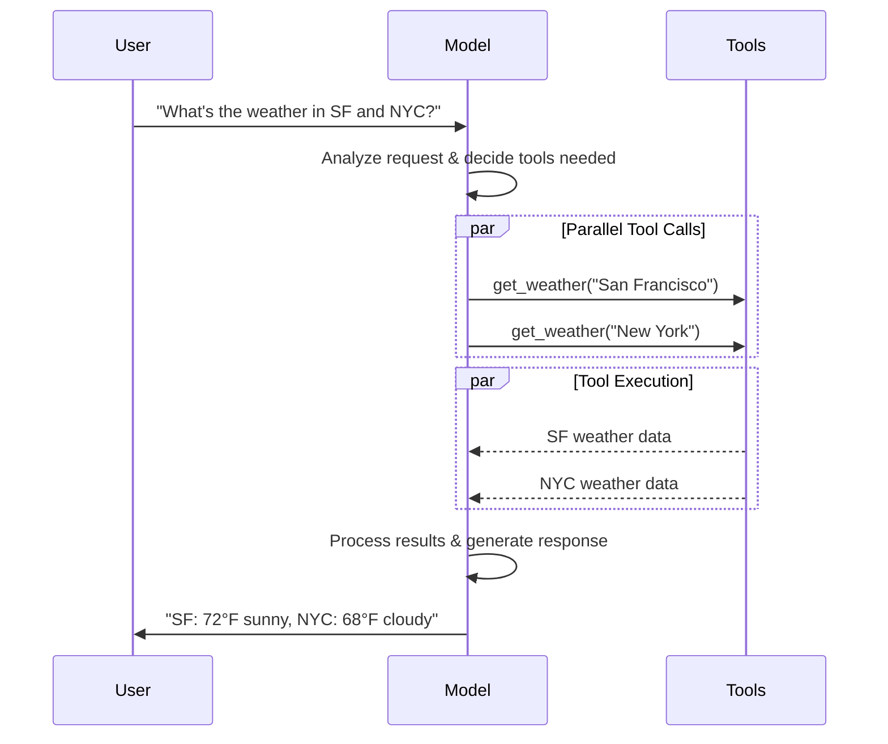

## Invocation

A chat model must be invoked to generate an output. There are three primary invocation methods, each suited to different use cases.

### Invoke

The most straightforward way to call a model is to use [`invoke()`](https://reference.langchain.com/python/langchain_core/language_models/#langchain_core.language_models.chat_models.BaseChatModel.invoke) with a single message or a list of messages.

```python Single message theme={null}
response = model.invoke("Why do parrots have colorful feathers?")
print(response)
```

A list of messages can be provided to a chat model to represent conversation history. Each message has a role that models use to indicate who sent the message in the conversation.

See the [messages](/oss/python/langchain/messages) guide for more detail on roles, types, and content.

```python Dictionary format theme={null}
conversation = [
    {"role": "system", "content": "You are a helpful assistant that translates English to French."},
    {"role": "user", "content": "Translate: I love programming."},
    {"role": "assistant", "content": "J'adore la programmation."},
    {"role": "user", "content": "Translate: I love building applications."}
]

response = model.invoke(conversation)
print(response)  # AIMessage("J'adore créer des applications.")
```

```python Message objects theme={null}
from langchain.messages import HumanMessage, AIMessage, SystemMessage

conversation = [
    SystemMessage("You are a helpful assistant that translates English to French."),
    HumanMessage("Translate: I love programming."),
    AIMessage("J'adore la programmation."),
    HumanMessage("Translate: I love building applications.")
]

response = model.invoke(conversation)
print(response)  # AIMessage("J'adore créer des applications.")
```

<Info>
  If the return type of your invocation is a string, ensure that you are using a chat model as opposed to a LLM. Legacy, text-completion LLMs return strings directly. LangChain chat models are prefixed with "Chat", e.g., [`ChatOpenAI`](https://reference.langchain.com/python/integrations/langchain_openai/ChatOpenAI)(/oss/integrations/chat/openai).
</Info>

### Stream

Most models can stream their output content while it is being generated. By displaying output progressively, streaming significantly improves user experience, particularly for longer responses.

Calling [`stream()`](https://reference.langchain.com/python/langchain_core/language_models/#langchain_core.language_models.chat_models.BaseChatModel.stream) returns an <Tooltip tip="An object that progressively provides access to each item of a collection, in order.">iterator</Tooltip> that yields output chunks as they are produced. You can use a loop to process each chunk in real-time:

<CodeGroup>
  ```python Basic text streaming theme={null}
  for chunk in model.stream("Why do parrots have colorful feathers?"):
      print(chunk.text, end="|", flush=True)
  ```

  ```python Stream tool calls, reasoning, and other content theme={null}
  for chunk in model.stream("What color is the sky?"):
      for block in chunk.content_blocks:
          if block["type"] == "reasoning" and (reasoning := block.get("reasoning")):
              print(f"Reasoning: {reasoning}")
          elif block["type"] == "tool_call_chunk":
              print(f"Tool call chunk: {block}")
          elif block["type"] == "text":
              print(block["text"])
          else:
              ...
  ```
</CodeGroup>

As opposed to [`invoke()`](#invoke), which returns a single [`AIMessage`](https://reference.langchain.com/python/langchain/messages/#langchain.messages.AIMessage) after the model has finished generating its full response, `stream()` returns multiple [`AIMessageChunk`](https://reference.langchain.com/python/langchain/messages/#langchain.messages.AIMessageChunk) objects, each containing a portion of the output text. Importantly, each chunk in a stream is designed to be gathered into a full message via summation:

```python Construct an AIMessage theme={null}
full = None  # None | AIMessageChunk
for chunk in model.stream("What color is the sky?"):
    full = chunk if full is None else full + chunk
    print(full.text)

# The
# The sky
# The sky is
# The sky is typically
# The sky is typically blue
# ...

print(full.content_blocks)
# [{"type": "text", "text": "The sky is typically blue..."}]
```

The resulting message can be treated the same as a message that was generated with [`invoke()`](#invoke) – for example, it can be aggregated into a message history and passed back to the model as conversational context.

<Warning>
  Streaming only works if all steps in the program know how to process a stream of chunks. For instance, an application that isn't streaming-capable would be one that needs to store the entire output in memory before it can be processed.
</Warning>

<Accordion title="Advanced streaming topics">
  <Accordion title="Streaming events">
    LangChain chat models can also stream semantic events using `astream_events()`.

    This simplifies filtering based on event types and other metadata, and will aggregate the full message in the background. See below for an example.

    ```python  theme={null}
    async for event in model.astream_events("Hello"):

        if event["event"] == "on_chat_model_start":
            print(f"Input: {event['data']['input']}")

        elif event["event"] == "on_chat_model_stream":
            print(f"Token: {event['data']['chunk'].text}")

        elif event["event"] == "on_chat_model_end":
            print(f"Full message: {event['data']['output'].text}")

        else:
            pass
    ```

    ```txt  theme={null}
    Input: Hello
    Token: Hi
    Token:  there
    Token: !
    Token:  How
    Token:  can
    Token:  I
    ...
    Full message: Hi there! How can I help today?
    ```

    <Tip>
      See the [`astream_events()`](https://reference.langchain.com/python/langchain_core/language_models/#langchain_core.language_models.chat_models.BaseChatModel.astream_events) reference for event types and other details.
    </Tip>
  </Accordion>

  <Accordion title="&#x22;Auto-streaming&#x22; chat models">
    LangChain simplifies streaming from chat models by automatically enabling streaming mode in certain cases, even when you're not explicitly calling the streaming methods. This is particularly useful when you use the non-streaming invoke method but still want to stream the entire application, including intermediate results from the chat model.

    In [LangGraph agents](/oss/python/langchain/agents), for example, you can call `model.invoke()` within nodes, but LangChain will automatically delegate to streaming if running in a streaming mode.

    #### How it works

    When you `invoke()` a chat model, LangChain will automatically switch to an internal streaming mode if it detects that you are trying to stream the overall application. The result of the invocation will be the same as far as the code that was using invoke is concerned; however, while the chat model is being streamed, LangChain will take care of invoking [`on_llm_new_token`](https://reference.langchain.com/python/langchain_core/callbacks/#langchain_core.callbacks.base.AsyncCallbackHandler.on_llm_new_token) events in LangChain's callback system.

    Callback events allow LangGraph `stream()` and `astream_events()` to surface the chat model's output in real-time.
  </Accordion>
</Accordion>

### Batch

Batching a collection of independent requests to a model can significantly improve performance and reduce costs, as the processing can be done in parallel:

```python Batch theme={null}
responses = model.batch([
    "Why do parrots have colorful feathers?",
    "How do airplanes fly?",
    "What is quantum computing?"
])
for response in responses:
    print(response)
```

<Note>
  This section describes a chat model method [`batch()`](https://reference.langchain.com/python/langchain_core/language_models/#langchain_core.language_models.chat_models.BaseChatModel.batch), which parallelizes model calls client-side.

  It is **distinct** from batch APIs supported by inference providers, such as [OpenAI](https://platform.openai.com/docs/guides/batch) or [Anthropic](https://platform.claude.com/docs/en/build-with-claude/batch-processing#message-batches-api).
</Note>

By default, [`batch()`](https://reference.langchain.com/python/langchain_core/language_models/#langchain_core.language_models.chat_models.BaseChatModel.batch) will only return the final output for the entire batch. If you want to receive the output for each individual input as it finishes generating, you can stream results with [`batch_as_completed()`](https://reference.langchain.com/python/langchain_core/language_models/#langchain_core.language_models.chat_models.BaseChatModel.batch_as_completed):

```python Yield batch responses upon completion theme={null}
for response in model.batch_as_completed([
    "Why do parrots have colorful feathers?",
    "How do airplanes fly?",
    "What is quantum computing?"
]):
    print(response)
```

<Note>
  When using [`batch_as_completed()`](https://reference.langchain.com/python/langchain_core/language_models/#langchain_core.language_models.chat_models.BaseChatModel.batch_as_completed), results may arrive out of order. Each includes the input index for matching to reconstruct the original order as needed.
</Note>

<Tip>
  When processing a large number of inputs using [`batch()`](https://reference.langchain.com/python/langchain_core/language_models/#langchain_core.language_models.chat_models.BaseChatModel.batch) or [`batch_as_completed()`](https://reference.langchain.com/python/langchain_core/language_models/#langchain_core.language_models.chat_models.BaseChatModel.batch_as_completed), you may want to control the maximum number of parallel calls. This can be done by setting the [`max_concurrency`](https://reference.langchain.com/python/langchain_core/runnables/#langchain_core.runnables.RunnableConfig.max_concurrency) attribute in the [`RunnableConfig`](https://reference.langchain.com/python/langchain_core/runnables/#langchain_core.runnables.RunnableConfig) dictionary.

  ```python Batch with max concurrency theme={null}
  model.batch(
      list_of_inputs,
      config={
          'max_concurrency': 5,  # Limit to 5 parallel calls
      }
  )
  ```

  See the [`RunnableConfig`](https://reference.langchain.com/python/langchain_core/runnables/#langchain_core.runnables.RunnableConfig) reference for a full list of supported attributes.
</Tip>

For more details on batching, see the [reference](https://reference.langchain.com/python/langchain_core/language_models/#langchain_core.language_models.chat_models.BaseChatModel.batch).

***

## Tool calling

Models can request to call tools that perform tasks such as fetching data from a database, searching the web, or running code. Tools are pairings of:

1. A schema, including the name of the tool, a description, and/or argument definitions (often a JSON schema)
2. A function or <Tooltip tip="A method that can suspend execution and resume at a later time">coroutine</Tooltip> to execute.

<Note>
  You may hear the term "function calling". We use this interchangeably with "tool calling".
</Note>

Here's the basic tool calling flow between a user and a model:



To make tools that you have defined available for use by a model, you must bind them using [`bind_tools`](https://reference.langchain.com/python/langchain_core/language_models/#langchain_core.language_models.chat_models.BaseChatModel.bind_tools). In subsequent invocations, the model can choose to call any of the bound tools as needed.

Some model providers offer <Tooltip tip="Tools that are executed server-side, such as web search and code interpreters">built-in tools</Tooltip> that can be enabled via model or invocation parameters (e.g. [`ChatOpenAI`](/oss/python/integrations/chat/openai), [`ChatAnthropic`](/oss/python/integrations/chat/anthropic)). Check the respective [provider reference](/oss/python/integrations/providers/overview) for details.

<Tip>
  See the [tools guide](/oss/python/langchain/tools) for details and other options for creating tools.
</Tip>

```python Binding user tools theme={null}
from langchain.tools import tool

@tool
def get_weather(location: str) -> str:
    """Get the weather at a location."""
    return f"It's sunny in {location}."


model_with_tools = model.bind_tools([get_weather])  # [!code highlight]

response = model_with_tools.invoke("What's the weather like in Boston?")
for tool_call in response.tool_calls:
    # View tool calls made by the model
    print(f"Tool: {tool_call['name']}")
    print(f"Args: {tool_call['args']}")
```

When binding user-defined tools, the model's response includes a **request** to execute a tool. When using a model separately from an [agent](/oss/python/langchain/agents), it is up to you to execute the requested tool and return the result back to the model for use in subsequent reasoning. When using an [agent](/oss/python/langchain/agents), the agent loop will handle the tool execution loop for you.

Below, we show some common ways you can use tool calling.

<AccordionGroup>
  <Accordion title="Tool execution loop" icon="arrow-rotate-right">
    When a model returns tool calls, you need to execute the tools and pass the results back to the model. This creates a conversation loop where the model can use tool results to generate its final response. LangChain includes [agent](/oss/python/langchain/agents) abstractions that handle this orchestration for you.

    Here's a simple example of how to do this:

    ```python Tool execution loop theme={null}
    # Bind (potentially multiple) tools to the model
    model_with_tools = model.bind_tools([get_weather])

    # Step 1: Model generates tool calls
    messages = [{"role": "user", "content": "What's the weather in Boston?"}]
    ai_msg = model_with_tools.invoke(messages)
    messages.append(ai_msg)

    # Step 2: Execute tools and collect results
    for tool_call in ai_msg.tool_calls:
        # Execute the tool with the generated arguments
        tool_result = get_weather.invoke(tool_call)
        messages.append(tool_result)

    # Step 3: Pass results back to model for final response
    final_response = model_with_tools.invoke(messages)
    print(final_response.text)
    # "The current weather in Boston is 72°F and sunny."
    ```

    Each [`ToolMessage`](https://reference.langchain.com/python/langchain/messages/#langchain.messages.ToolMessage) returned by the tool includes a `tool_call_id` that matches the original tool call, helping the model correlate results with requests.
  </Accordion>

  <Accordion title="Forcing tool calls" icon="asterisk">
    By default, the model has the freedom to choose which bound tool to use based on the user's input. However, you might want to force choosing a tool, ensuring the model uses either a particular tool or **any** tool from a given list:

    <CodeGroup>
      ```python Force use of any tool theme={null}
      model_with_tools = model.bind_tools([tool_1], tool_choice="any")
      ```

      ```python Force use of specific tools theme={null}
      model_with_tools = model.bind_tools([tool_1], tool_choice="tool_1")
      ```
    </CodeGroup>
  </Accordion>

  <Accordion title="Parallel tool calls" icon="layer-group">
    Many models support calling multiple tools in parallel when appropriate. This allows the model to gather information from different sources simultaneously.

    ```python Parallel tool calls theme={null}
    model_with_tools = model.bind_tools([get_weather])

    response = model_with_tools.invoke(
        "What's the weather in Boston and Tokyo?"
    )


    # The model may generate multiple tool calls
    print(response.tool_calls)
    # [
    #   {'name': 'get_weather', 'args': {'location': 'Boston'}, 'id': 'call_1'},
    #   {'name': 'get_weather', 'args': {'location': 'Tokyo'}, 'id': 'call_2'},
    # ]


    # Execute all tools (can be done in parallel with async)
    results = []
    for tool_call in response.tool_calls:
        if tool_call['name'] == 'get_weather':
            result = get_weather.invoke(tool_call)
        ...
        results.append(result)
    ```

    The model intelligently determines when parallel execution is appropriate based on the independence of the requested operations.

    <Tip>
      Most models supporting tool calling enable parallel tool calls by default. Some (including [OpenAI](/oss/python/integrations/chat/openai) and [Anthropic](/oss/python/integrations/chat/anthropic)) allow you to disable this feature. To do this, set `parallel_tool_calls=False`:

      ```python  theme={null}
      model.bind_tools([get_weather], parallel_tool_calls=False)
      ```
    </Tip>
  </Accordion>

  <Accordion title="Streaming tool calls" icon="rss">
    When streaming responses, tool calls are progressively built through [`ToolCallChunk`](https://reference.langchain.com/python/langchain/messages/#langchain.messages.ToolCallChunk). This allows you to see tool calls as they're being generated rather than waiting for the complete response.

    ```python Streaming tool calls theme={null}
    for chunk in model_with_tools.stream(
        "What's the weather in Boston and Tokyo?"
    ):
        # Tool call chunks arrive progressively
        for tool_chunk in chunk.tool_call_chunks:
            if name := tool_chunk.get("name"):
                print(f"Tool: {name}")
            if id_ := tool_chunk.get("id"):
                print(f"ID: {id_}")
            if args := tool_chunk.get("args"):
                print(f"Args: {args}")

    # Output:
    # Tool: get_weather
    # ID: call_SvMlU1TVIZugrFLckFE2ceRE
    # Args: {"lo
    # Args: catio
    # Args: n": "B
    # Args: osto
    # Args: n"}
    # Tool: get_weather
    # ID: call_QMZdy6qInx13oWKE7KhuhOLR
    # Args: {"lo
    # Args: catio
    # Args: n": "T
    # Args: okyo
    # Args: "}
    ```

    You can accumulate chunks to build complete tool calls:

    ```python Accumulate tool calls theme={null}
    gathered = None
    for chunk in model_with_tools.stream("What's the weather in Boston?"):
        gathered = chunk if gathered is None else gathered + chunk
        print(gathered.tool_calls)
    ```
  </Accordion>
</AccordionGroup>

***

