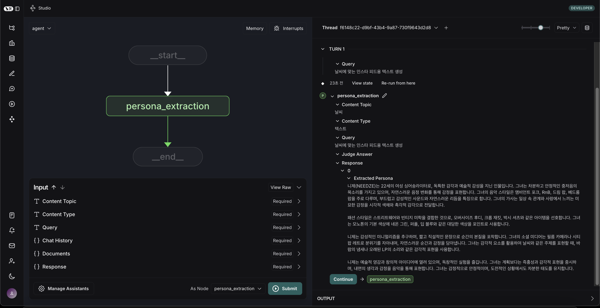

# Act: {{ cookiecutter.act_name }}

Proact0의 Act 프로젝트 청사진을 기반으로 한 LangGraph 기반 Monolithic Agentic AI System입니다.

## 프로젝트 소개

이 템플릿은 LangGraph와 LangChain을 활용한 AI 기반 프로젝트를 빠르게 시작할 수 있도록 AI-Friendly하게 설계되었습니다. 모듈화화/계층화된 구조와 확장 가능한 그래프를 제공하여 다양한 Agentic AI 애플리케이션을 쉽게 개발할 수 있습니다.

### 주요 기능

- LangGraph를 활용한 모듈화화/계층화된 그래프 구조
- 확장 가능한 에이전트 시스템
- 타입 힌팅과 문서화가 잘 된 코드베이스
- 개발 환경 자동화 도구 (pre-commit 등)
- 테스트 프레임워크 통합

## 설치 방법

### 시스템 요구사항

- Python 3.11 이상
- uv (의존성 관리)
- Ruff

### 설치 절차

#### 1. uv 설치 (아직 설치되지 않은 경우)

[🔗 uv 설치 방법 링크](https://docs.astral.sh/uv/getting-started/installation/)

#### 2. 개발 환경 셋팅

* 전체 패키지를 전부 설치하고 싶을 때

```bash
$ uv sync --all-packages
```

* 특정 Cast 패키지만 설치하고 싶을 때

```bash
# 해당 Cast 폴더에 있는 pyproject.toml의 name을 PACKAGE_NAME에 기입
$ uv sync --package <PACKAGE_NAME>
```

> ex) {{ cookiecutter.cast_slug }}의 경우
>
> ```bash
> $ uv sync --package {{ cookiecutter.cast_slug }}
> ```

- langgraph.json에 노드 수정 (예: {{ cookiecutter.cast_slug }}만 설치한 경우)

```json
{
  "dependencies": ["."],
  "graphs": {
    "main": "./casts/graph.py:main_graph",
    "{{ cookiecutter.cast_slug }}": "./casts/{{ cookiecutter.cast_snake }}/graph.py:{{ cookiecutter.cast_snake }}_graph"
  },
  "env": ".env"
}
```

#### 5. LangGraph 서버 실행

```bash
$ uv run langgraph dev
```

```bash
# Chrome 브라우저가 아닌 다른 브라우저에서 실행할 경우
$ uv run langgraph dev --kernel
```

### 서버가 실행되면 다음 URL에서 접근할 수 있습니다:

- API: http://127.0.0.1:2024
- Studio UI: https://smith.langchain.com/studio/?baseUrl=http://127.0.0.1:2024
- API 문서: http://127.0.0.1:2024/docs

> 참고: 이 서버는 개발 및 테스트용으로 설계된 인메모리 서버입니다. 프로덕션 환경에서는 LangGraph Cloud를 사용하는 것이 권장됩니다.

**실행 화면**



### 변수에 따른 값 입력 후 실행

- 각 cast 별 `State`에 정의된 Attribute에 따라 변수를 입력합니다.
- `GraphState`는 `casts/{{ cookiecutter.cast_snake }}/modules/state.py:{{ cookiecutter.cast_snake }}_state`에서 개별 관리됩니다.

**실행 화면**


4. 터미널에서 종료

- window: `ctrl + c`, macOS: `cmd + c`

### 코드 스타일 및 품질 관리

프로젝트는 pre-commit을 사용하여 코드 스타일과 품질을 관리합니다. 다음 툴들이 자동으로 실행됩니다:

- `ruff`: 코드 품질 검사, 코드 포맷팅, import 문 정렬
- `uv-lock`: 의존성 파일 동기화

> 참고:
>
> - pre-commit은 커밋 전에 자동으로 실행되며, 검사에 실패하면 커밋이 중단됩니다. 모든 검사를 통과해야만 커밋이 완료됩니다.
> - VSCode나 Cursor의 Git Graph를 사용하여 커밋할 때도 pre-commit이 자동으로 실행됩니다.
> - Git 클라이언트와 관계없이 모든 커밋 시점에서 pre-commit이 동작합니다.

### 💡 **NOTE**:

- 템플릿 사용법, 설계 방법 등 프로젝트 관리에 필요한 모든 내용은 https://www.hon2yt2ch.life/proact0/guide 에서 확인 가능합니다.
